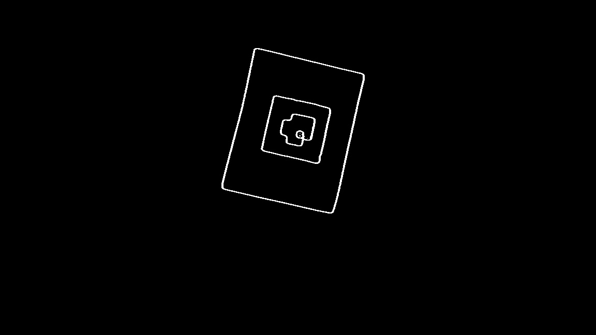

# April-Tag-Detection-and-Tacking

This project implements custom AR tag detection, tracking and superimposing an image and a 3D projection over the tag.
A detailed report on the execution can be found [here](https://github.com/aditiramadwar/April-Tag-Detection-and-Tacking/blob/main/Report.pdf)

Test video found [here](https://drive.google.com/file/d/1MWJOLJcFJvRporEfZ-j_lPbGkVuRv0So/view)

## Initial Data  
The edge detection and decoding of the custom AR tag can be visualized here
a) This will give the output of FFT on the first frame of the test video
b) This will also give the tag IDs of the two AR tags in the data/ folder, ar_tag.png and test.jpg

    python3 get_edges.py

## Superimposed image
This file will superimpose the [Testudo](https://github.com/aditiramadwar/April-Tag-Detection-and-Tacking/blob/main/data/testudo.png) image onto the AR tag in the video. 

	 python3 superimposition.py
A video of this can be found [here](https://drive.google.com/file/d/1VplSTPKKCVewUl7ahmtW_9ra3Wc85yw8/view?usp=sharing)

## Augmented Reality
This file will project a 3D cube onto the AR tag in the video 

    python3 augmented_reality.py
A video of this can be found [here](https://drive.google.com/file/d/1wJ_TR2KZmbtDgHyG_QL4jqPfEcMAVapM/view?usp=sharing)

